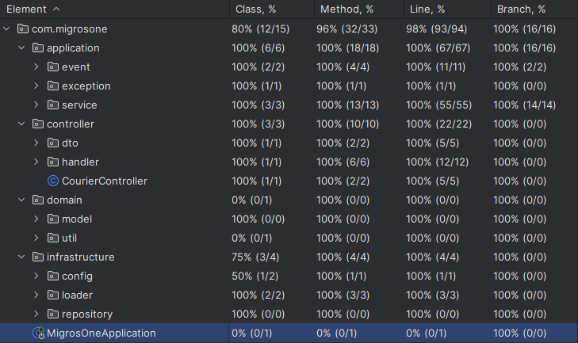

## Migros One Case - Courier Tracker

This repository contains REST API app which provides following abilities;
* Send Courier Location
* Get Travel Total Distance

### Unit & Integration tests Coverage %100 ✅


#### 📌 Extensibility Note:
```
This application currently uses PostgreSQL and in-memory storage to keep things simple and fast.
Since it's a monolithic and lightweight system, i intentionally avoided overengineering.
However, in a production environment, store entry logging can be decoupled using an event-driven architecture such as Apache Kafka to improve scalability and fault tolerance.
Additionally, courier state can be externalized to Redis to ensure persistence across restarts and enable real-time access in a distributed setup.
```

# 🚀 Installation

Firstly get project from github:
```
https://github.com/onurozbay7/migrosone.git
```

Run this command:

``mvn clean package -DskipTests`` (Integration and context load tests require PostgreSQL to be running)

Then dockerize:
- Application
- PostgreSQL
- Pg Admin UI

with this command:

``docker-compose up --build``

# 📚 Docs

> After run project, you can check API doc which created with swagger.


[Swagger Documentation](http://localhost:8080/swagger-ui/index.html)

[Postman Collection](Migros-One.postman_collection.json)